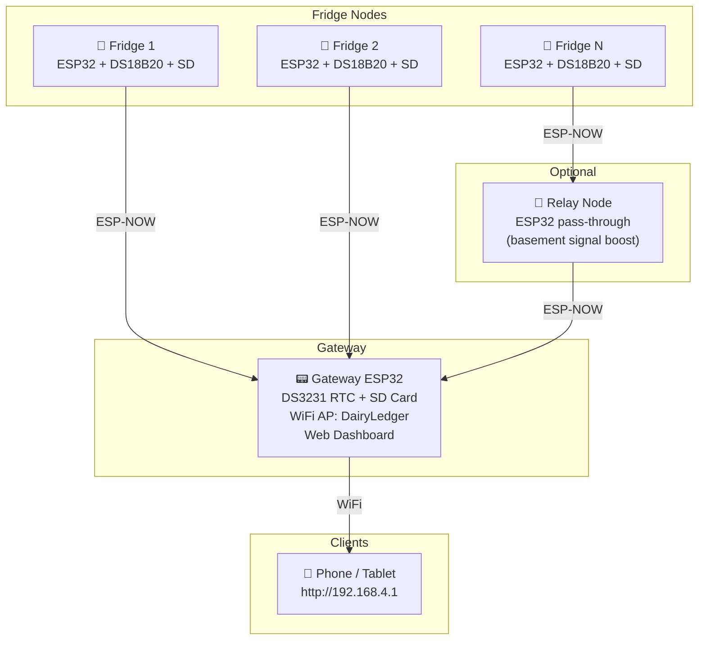

# 🐐 DairyLedger — Goat Farm Temperature Monitoring System

A distributed, FDA-compliant temperature monitoring system for goat farm cheese and yogurt production refrigeration. Built entirely on ESP32 microcontrollers — no Raspberry Pi or external server required.

## Overview

Each refrigeration unit gets a dedicated ESP32 node with multiple high-accuracy DS18B20 temperature probes. Nodes communicate wirelessly via **ESP-NOW** (peer-to-peer, no WiFi infrastructure needed) to a central gateway ESP32, which hosts an embedded web dashboard over WiFi. Every reading is dual-logged — locally on the node's SD card and centrally on the gateway — for redundancy and easy regulatory inspection.

### Why This Exists

FDA 21 CFR Part 117 (FSMA) and state dairy regulations require:
- Refrigerated dairy storage at **≤ 41°F (5°C)**
- Timestamped temperature logs retained for **1–2 years**
- Demonstrated corrective action when temps go out of range

DairyLedger automates compliance, provides real-time alerting, and produces inspector-ready CSV exports.

## Architecture



- **Nodes** read probes, log to SD, and broadcast readings via ESP-NOW
- **Gateway** receives all data, logs to its own SD, serves a web dashboard, and drives alert buzzers
- **Relay node** (optional) re-broadcasts ESP-NOW packets for basement fridges with weak signal

## Features

- **Zero-config node setup** — flash firmware, power on, and the node auto-generates an ID and appears on the dashboard
- **Dual logging** — every reading saved to both the node SD card and gateway SD card
- **Offline resilience** — nodes continue logging locally if the gateway is unreachable, with automatic backfill when connectivity returns
- **Web dashboard** — responsive SPA accessible from any phone/tablet over WiFi, with live fridge cards, temperature charts, and alert management
- **Admin UI** — rename nodes/probes, set thresholds, configure WiFi, and manage calibration offsets — no code changes needed
- **SD card health monitoring** — detects read-only or failing cards and alerts via buzzer + dashboard
- **Time sync** — gateway maintains master time via DS3231 RTC + NTP; nodes sync from gateway ACKs (no RTC hardware needed on nodes)
- **CSV exports** — inspector-ready reports filterable by date range and node
- **Audible alerts** — piezo buzzers on both nodes (local) and gateway (farmhouse) for temperature exceedances

## Hardware

### Per-Fridge Node

| Component | Part |
|-----------|------|
| Microcontroller | ESP32-C3-DevKitM-01 |
| Temp Probes | DS18B20 waterproof, stainless steel tip (2–3 per fridge) |
| Storage | MicroSD card module + 8GB card |
| Alert | Active piezo buzzer |
| Status LED | Built-in WS2812 RGB on GPIO8 |

### Gateway

| Component | Part |
|-----------|------|
| Microcontroller | ESP32-C3-DevKitM-01 |
| Real-Time Clock | DS3231 module (battery-backed) |
| Storage | MicroSD card module + 32GB card |
| Alert | Active piezo buzzer |

### Full System (5 fridges + gateway + relay)

See the [Bill of Materials](PROJECT_PLAN.md#9-bill-of-materials) in the project plan for detailed pricing.

## Repository Structure

```
goats/
├── firmware/
│   ├── node/           # Fridge node firmware (ESP32-C3)
│   │   └── src/
│   ├── gateway/        # Gateway firmware — hub + web dashboard + alerting
│   │   ├── src/
│   │   └── data/       # Web dashboard assets (HTML/CSS/JS)
│   └── relay/          # Optional relay node for basement signal boost
│       └── src/
├── tools/
│   └── mock_server.py  # Development mock server
├── docs/
│   ├── WIRING.md       # Wiring diagrams and pin assignments
│   └── FLASHING.md     # Firmware flashing instructions
└── PROJECT_PLAN.md     # Full system design document
```

## Getting Started

### Prerequisites

- [PlatformIO](https://platformio.org/) (CLI or VS Code extension)
- ESP32-C3-DevKitM-01 boards
- Hardware components per the BOM

### Building & Flashing

Each firmware target has its own PlatformIO project:

```bash
# Build and flash a fridge node
cd firmware/node
pio run --target upload

# Build and flash the gateway
cd firmware/gateway
pio run --target upload

# Upload web dashboard assets to gateway LittleFS
cd firmware/gateway
pio run --target uploadfs
```

See [docs/FLASHING.md](docs/FLASHING.md) for detailed flashing instructions and [docs/WIRING.md](docs/WIRING.md) for wiring diagrams.

### Running the mock server

you can preview the web dashboard without any ESP32 hardware using the included mock server:

```bash
python3 tools/mock_server.py
```

The open http://localhost:8080 in your browser. The server serves the gateway dashboard assets with simulated node data.

### Deploying a New Node

1. Flash the generic node firmware to an ESP32-C3 — no configuration needed
2. Power it on — the node auto-generates a 6-character ID and starts broadcasting
3. Open the gateway dashboard and navigate to the Admin page
4. The new node appears as "Unconfigured Node" — give it a label, set thresholds
5. Probes are auto-discovered — label each one (e.g., "Top Shelf", "Door Area")

### Accessing the Dashboard

| Mode | How to Access |
|------|---------------|
| **AP-only** (default) | Connect to `DairyLedger` WiFi → `http://192.168.4.1` |
| **STA+AP** (home WiFi configured) | `http://dairyledger.local` from any device on the network |

## Communication Protocol

- **ESP-NOW** — peer-to-peer 2.4GHz, ~200m line-of-sight, 250-byte payloads, <10ms latency
- Nodes **broadcast** readings (no pairing required)
- Gateway **auto-registers** new nodes on first contact and sends unicast ACKs
- ACKs include the current time for node clock synchronization
- Readings that fail to deliver are queued and **backfilled** automatically (oldest-first, 5 per cycle)

## Alert Thresholds

| Condition | Warning | Critical |
|-----------|---------|----------|
| High temp | > 3.3°C (38°F) | > 5.0°C (41°F) |
| Low temp | < -2.2°C (28°F) | < -3.9°C (25°F) |
| Probe failure | — | Sensor not responding |
| SD card error | — | Card missing, read-only, or write failure |
| Comms loss | 3 missed syncs | 10 missed syncs |

All thresholds are configurable per-node via the Admin dashboard.

## SD Card Log Format

Logs are human-readable CSV files with daily rotation:

```
/logs/2026-02-15.csv
```

```csv
timestamp,datetime,node_id,node_label,probe_1_addr,probe_1_temp_c,probe_1_temp_f,...,alert,synced
1739635200,2026-02-15T12:00:00,KF7B2X,Cheese Fridge,28FF1A2B3C4D5E01,3.25,37.85,...,OK,Y
```

At 15-minute intervals with 3 probes, an 8GB card holds **~1,500 years** of data.

## Project Phases

1. **Prototype & Trial** — 2 fridges + gateway, validate ESP-NOW range, dashboard, and alerting
2. **Full Deployment** — expand to all 5 fridges, add relay node if needed
3. **Dashboard Polish & Compliance** — trend charts, export page, inspector review
4. **Hardening** — custom PCBs, permanent enclosures, battery backup

## License

This project is for private use on a goat farm dairy operation.
