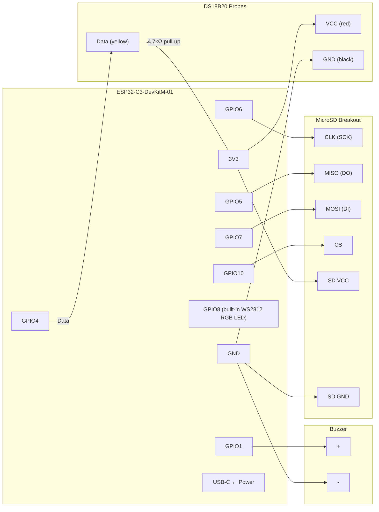
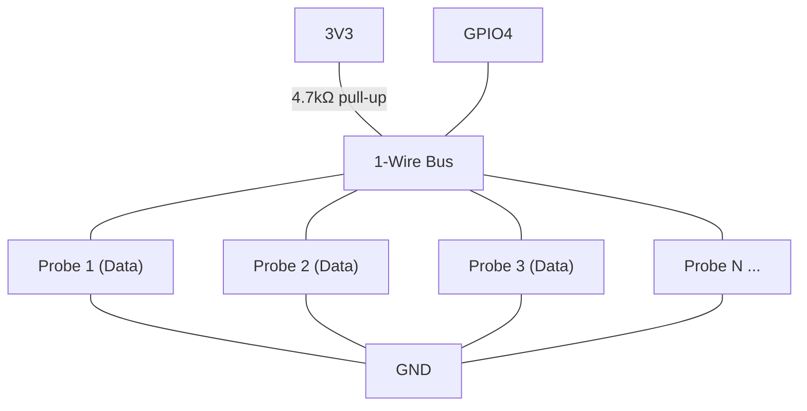
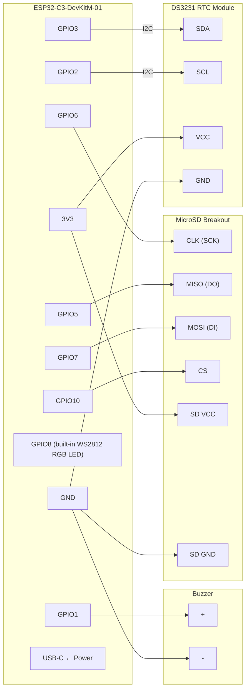

# DairyLedger — Wiring Guide

Assembly instructions for ESP32-C3-DevKitM-01 boards.

---

## 🧊 Sensor Node (one per fridge)

### Components
| Part | Qty | Notes |
|------|-----|-------|
| ESP32-C3-DevKitM-01 | 1 | RISC-V, built-in RGB LED on GPIO8 |
| DS18B20 waterproof probe | 1–6 | Stainless steel, 1m cable |
| MicroSD SPI breakout | 1 | SPI interface |
| MicroSD card | 1 | Any size, FAT32 formatted |
| 4.7kΩ resistor | 1 | 1-Wire pull-up |
| Piezo buzzer (active) | 1 | 3.3V, two-pin |
| Breadboard + jumper wires | — | Or solder to perfboard |
| USB-C cable + power adapter | 1 | 5V supply |

### Wiring Diagram

### DS18B20 Multi-Probe Wiring

All probes share the same 1-Wire bus on GPIO4. Each probe has a unique
64-bit address and is automatically discovered.

**Wire colors (standard DS18B20):**
- 🔴 Red = VCC (3.3V)
- ⚫ Black = GND
- 🟡 Yellow = Data (GPIO4)

### Notes
- The 4.7kΩ resistor goes between the Data line and 3V3 (not GND).
- All probes connect in parallel to the same three wires.
- Route probe cables through the fridge door seal carefully to avoid
  pinching. The slim stainless steel tip fits through most seals.
- USB power can come from any 5V phone charger.

---

## 🖥️ Gateway (one total, in farmhouse)

### Components
| Part | Qty | Notes |
|------|-----|-------|
| ESP32-C3-DevKitM-01 | 1 | Same board as nodes |
| DS3231 RTC module | 1 | I2C, battery-backed |
| CR2032 battery | 1 | For DS3231 backup |
| MicroSD SPI breakout | 1 | SPI interface |
| MicroSD card | 1 | Larger card recommended (8GB+) |
| Piezo buzzer (active) | 1 | 3.3V, two-pin |
| USB-C cable + power adapter | 1 | 5V supply |

### Wiring Diagram

### DS3231 Module Pins

Most DS3231 breakout boards have 4 pins:

| DS3231 Pin | ESP32-C3 Pin |
|------------|-------------|
| VCC | 3V3 |
| GND | GND |
| SDA | GPIO3 |
| SCL | GPIO2 |

**No external pull-ups needed** — the DS3231 module includes them.

### Notes
- Place the gateway where it can reach your WiFi router for NTP time sync.
- If no WiFi is available, the DS3231 battery keeps time accurate for years.
- The gateway creates an open `DairyLedger` WiFi network (no password) you
  can connect to with your phone/laptop to view the dashboard.
- If the home WiFi drops, the gateway retries every 30 seconds while the
  open AP stays available as a fallback.
- Dashboard URL: `http://192.168.4.1` (on DairyLedger AP) or
  `http://dairyledger.local` (on your home network).

---

## 📡 Relay (optional, one per gap in coverage)

### Components
| Part | Qty | Notes |
|------|-----|-------|
| ESP32-C3-DevKitM-01 | 1 | Same board |
| USB-C cable + power adapter | 1 | 5V supply |

### Wiring

**None!** The relay uses only the built-in RGB LED on GPIO8.
Just plug in USB power and flash the relay firmware.

Place it roughly halfway between the most distant node and the gateway.

---

## 📋 Pre-Flight Checklist

### Before First Power-On
- [ ] Verify all solder joints / breadboard connections
- [ ] Insert CR2032 battery into DS3231 (gateway only)
- [ ] Insert formatted MicroSD cards
- [ ] Flash firmware via USB-C (see README)

### First Boot Sequence
1. **Power on the gateway first** — it starts the WiFi AP and listens
2. **Power on each node** — they auto-generate IDs and broadcast
3. **Check the dashboard** — connect to `DairyLedger` WiFi, open `http://192.168.4.1`
4. **Rename nodes** — use the Admin page to give each node a label (e.g. "Cheese Fridge 1")
5. **Configure WiFi** — enter your home WiFi credentials on the Admin page
6. **Verify temps** — compare readings with your reference thermometer

### LED Color Guide

| Color | Meaning |
|-------|---------|
| 🟢 Dim green | All OK |
| 🟡 Yellow | Warning — temp approaching threshold |
| 🔴 Red | Critical — temp out of compliance |
| 🔵 Blue | Sensor error (probe disconnected) |
| 🟣 Purple | Node offline (gateway only) |
| 🔵 Cyan flash | Relay forwarding a message |
